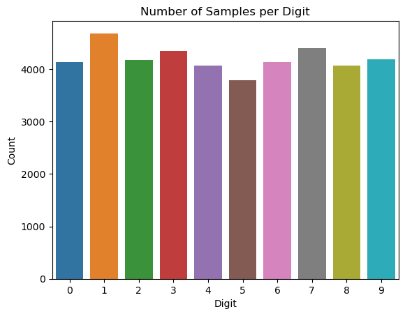
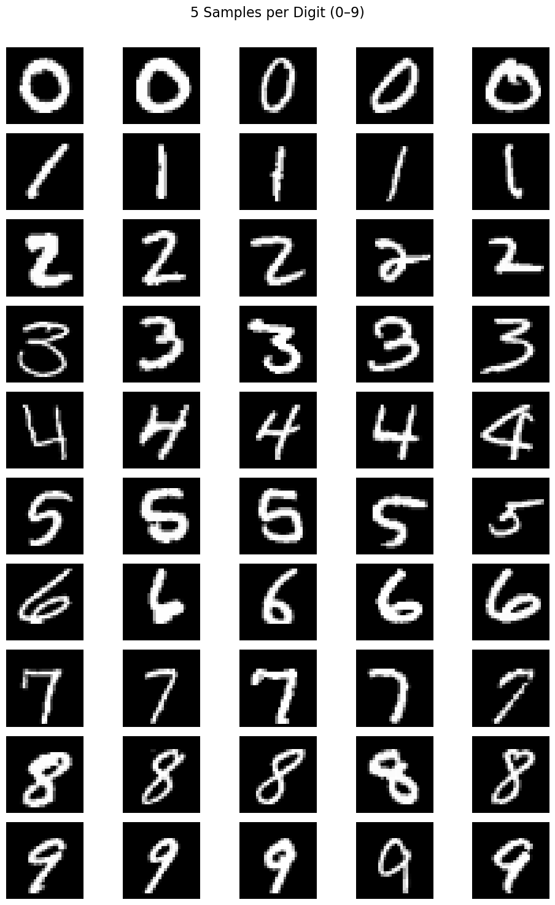
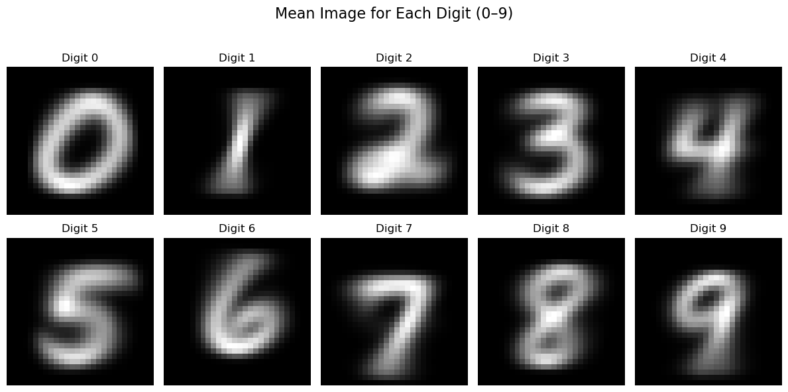
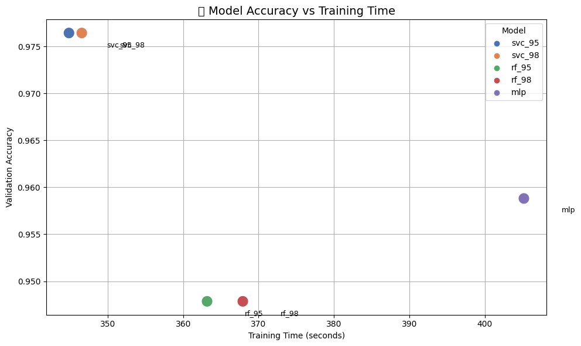
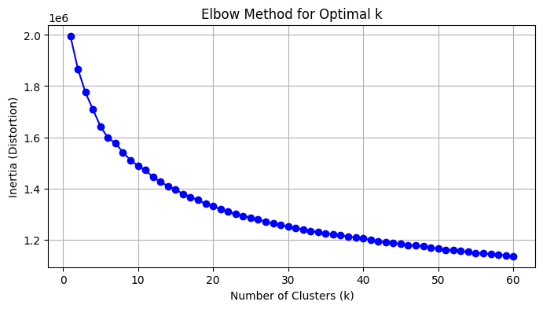
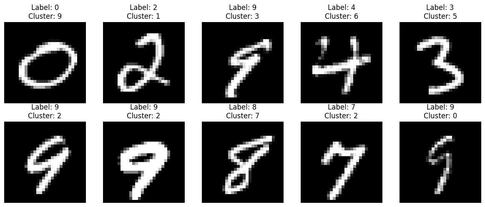
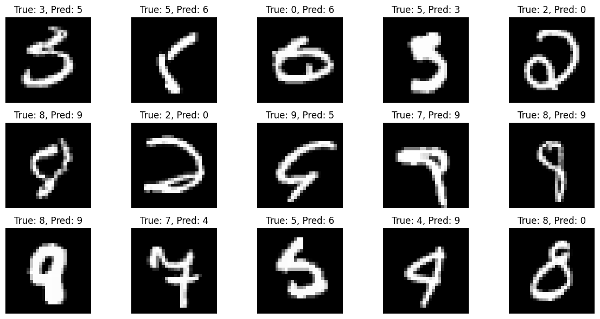
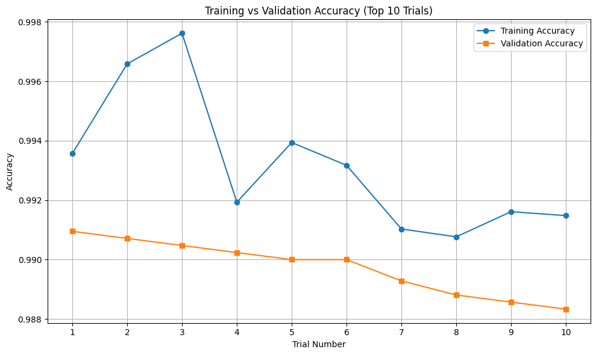
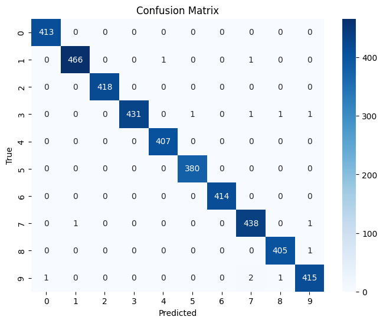

# 🧠 Digit Recognizer – Dimensionality Reduction + ML/DL Exploration

<div align="center">

[](https://www.kaggle.com/competitions/digit-recognizer/overview)

</div>

---

## 🧾 Final Observations

| Technique                   | Val Accuracy | Kaggle Score |
|----------------------------|--------------|--------------|
| PCA + SVC                  | 97.50%       | 97.46%       |
| Autoencoder + MLP          | 97.33%       | -            |
| Segmentation + Ensemble    | 91.33%       | -            |
| Base CNN                   | 99.10%       | 98.94%       |
| CNN + Augmentation         | **99.60%**   | **99.38%**   |

> 📌 Currently best score: **0.99332** (Augmented CNN + Transfer Learning) [stands at **192** out of **2.3k**]

---

## 📊 Key Visualizations

| Image | Description |
|-------|-------------|
|  | **Digit distribution** in training data |
|  | Sample training images |
|  | Mean image for each digit |
|  | Accuracy vs Time for classical models |
|  | Elbow curve to find optimal K (kMeans) |
|  | Segmented images using KMeans |
|  | Misclassified images in CNN |
|  | Accuracy trend across hyperparameter trials |
|  | Confusion matrix of best CNN model |

---

## 🎯 Competition Overview

### Goal

Classify grayscale images of hand-drawn digits (0–9). The dataset is from the **classic MNIST** challenge.

> 📝 Evaluation Metric: **Categorization Accuracy**

---

## 📂 Dataset Description

- `train.csv`: 785 columns (label + 784 pixels)
- `test.csv`: 784 pixel columns, no label
- Image Size: **28x28 pixels**, flattened

---

## 🚦 Ideal For

- Beginners in **machine learning**
- Intermediate coders exploring **computer vision**
- Practitioners looking to try **dimensionality reduction**, **CNNs**, **ensembles**

---

---

## 📌 Observations & Key Takeaways

| Technique                    | Observation                                                                 |
|-----------------------------|-----------------------------------------------------------------------------|
| **PCA + SVC**                | Achieved strong performance (~97.5% val, 97.46% Kaggle). Great for clean, low-res grayscale digits. |
| **Autoencoder + MLP**        | Comparable to PCA but not significantly better. Useful for non-linear patterns. |
| **Image Segmentation (kMeans)** | Did not improve accuracy. Likely because MNIST digits are sparse and uniform; clustering doesn't capture meaningful segments. |
| **Random Forest (RF)**       | Less effective than SVC. May underperform due to high-dimensional sparse input, lacks kernel flexibility. |
| **Base CNN**                 | Outperformed classical models (99.1% val, 98.94% Kaggle). Strong baseline with minimal tuning. |
| **CNN + Data Augmentation**  | Best overall (99.6% val, 99.38% Kaggle). Helped reduce overfitting and improved generalization. |
| **Stacked Ensemble (SVC + RF + MLP)** | Accuracy similar to best individual model (SVC). Stacking adds robustness but not drastic gains. |
| **Transfer Learning (TL)**   | Mixed results. Pre-trained features didn’t generalize well to small grayscale digits without careful fine-tuning. |

📌 Overall, **simple PCA + SVC**, or **CNNs with augmentation**, consistently performed best for this task.

---

## 🔍 Project Goals

- Explore **PCA** and **Autoencoders**
- Segment digits using **kMeans clustering**
- Compare **SVC, RF, CNN, MLP**
- Implement **data augmentation**
- Apply **ensemble learning**
- Track performance via visual reports

---

## ⚙️ Approach Outline

```text
1. Data Exploration & Visualization
2. Dimensionality Reduction (PCA, Autoencoders)
3. Clustering (kMeans)
4. Classical ML (SVC, RF)
5. Deep Learning (CNN, MLP)
6. Data Augmentation
7. Ensemble Techniques
8. Evaluation & Visualization
```

## 📉 Dimensionality Reduction

| Technique    | Highlights                       |
|--------------|----------------------------------|
| **PCA**      | Linear, variance-based           |
| **Autoencoder** | Non-linear, learned compression |

---

## 📦 Image Segmentation (Clustering)

- Applied **kMeans clustering** to images
- Used **cluster membership** as additional features for ML models
- Selected optimal `k` using the **Elbow Method**

---

## 🧠 Machine Learning Models

| Model              | Input Features         | Remarks                          |
|--------------------|------------------------|----------------------------------|
| **SVC**            | PCA, Segmentation      | High-performing on reduced dims |
| **Random Forest**  | PCA                    | Robust and interpretable         |
| **MLP**            | Autoencoded features   | Competitive with CNN             |
| **CNN (Baseline)** | Raw                    | Strong baseline performance      |
| **CNN + Augmentation** | Augmented raw      | Best performance observed        |

---

## 🧪 Data Augmentation

- **Techniques Used**:
  - Rotation  
  - Zoom  
  - Shifting  

- **Tool**: `ImageDataGenerator` (Keras)

- **Impact**:
  - Reduced overfitting  
  - Improved generalization  

---

## 🤝 Ensemble Methods

- **Soft Voting**:
  - Combines predictions using **average of class probabilities**

- **Stacking**:
  - Base models: `SVC`, `RF`, `MLP`  
  - Meta-model: `GradientBoostClassifier`

---

## 🧪 Evaluation Strategy

- 📈 Accuracy tracking on validation & Kaggle leaderboard  
- 🧩 Confusion matrix visualized for best models  
- 🔍 Inspection of **misclassified examples** (plotted for CNN)  
- ⏱️ Comparison of **training time vs performance**

---

## 📁 Project Structure

```
digit-recognizer/
├── data/                  # Dataset files (train.csv, test.csv, etc.)
├── notebooks/             # Jupyter notebooks for each experiment
│   ├── 01_explore_data.ipynb         # Initial EDA
│   ├── 02_pca_classical_ml.ipynb     # PCA + SVC, RF
│   ├── 03_autoencoder_ml.ipynb       # Autoencoder + SVC
│   ├── 04_kmeans_features.ipynb      # kMeans segmentation + ML
│   ├── 05_cnn_baseline.ipynb         # Baseline CNN
│   ├── 06_cnn_augmented.ipynb        # CNN with augmentations
│   ├── 07_ensemble_models.ipynb      # Voting/stacking ensembles
│   └── 08_visualizations.ipynb       # t-SNE, UMAP plots
├── models/                # Saved models (Pickle, H5, etc.)
├── outputs/               # Predictions and logs
├── requirements.txt       # List of required packages
└── README.md              # Project overview
```

---

## 🧪 Planned Experiments

| Experiment                       | Status | Notes                                |
|----------------------------------|--------|--------------------------------------|
| Baseline CNN                     | ✅     |                                      |
| PCA + SVC                        | ✅     | Try 95% and 98% retained variance    |
| PCA + RF                         | ✅     | Check for overfitting                |
| Autoencoder + SVC                | ✅     | Compare vs PCA                       |
| kMeans Cluster Features + ML     | ✅     | Convert clusters into feature sets   |
| CNN with Augmentation            | ✅     | Improve generalization               |
| Stacked Model (SVC+RF+CNN)       | ✅     | Final ensemble                       |

---

## 🛠 Tools & Libraries Used

- **Python**, **NumPy**, **Pandas**, **Scikit-learn**  
- **TensorFlow / Keras**  
- **Matplotlib / Seaborn**  
- **UMAP / t-SNE** (for visualization)  
- **Gradio** (for interactive demos, optional)

---

## 🧠 Learnings & Reflections (To be updated)

- 📌 Comparative impact of **PCA vs Autoencoder**  
- 📌 When to prefer **classical ML over DL**  
- 📌 Efficiency of **ensembles in small datasets**  
- 📌 Real-world applications of **dimensionality reduction**

---

## 📜 License

**MIT License** – Free to use with attribution.  
Digit data provided by [Kaggle](https://www.kaggle.com/competitions/digit-recognizer/overview).

---

## 👨‍💻 Author

- **Name**: Guna Venkat Doddi  
- **Project**: Part of `SSJ3-Kaggle-Projects` repository  
- **Contact**: [](https://github.com/Guna-Venkat)s
