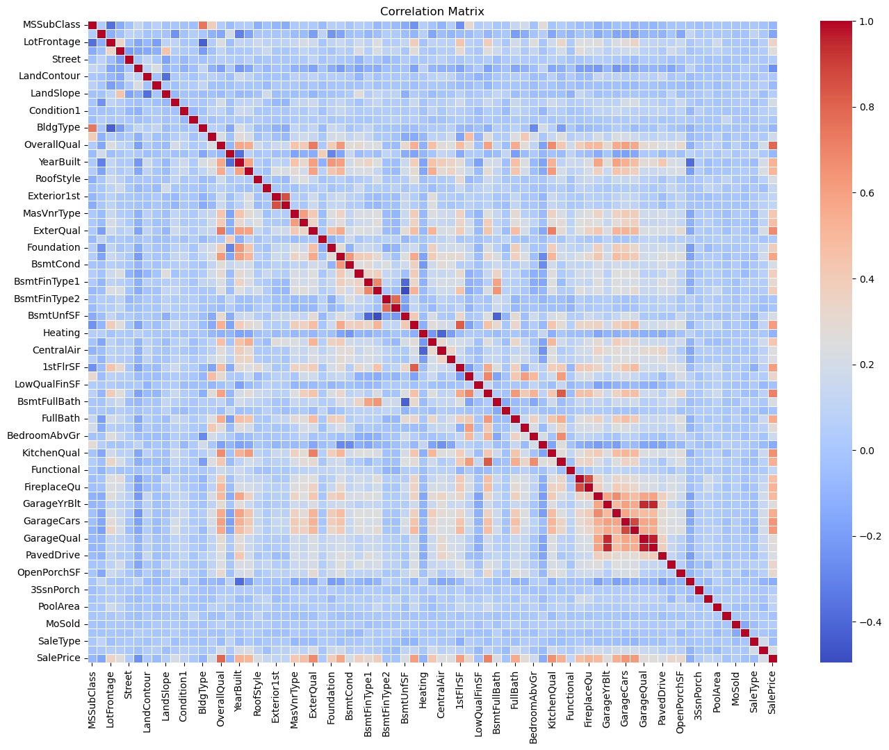
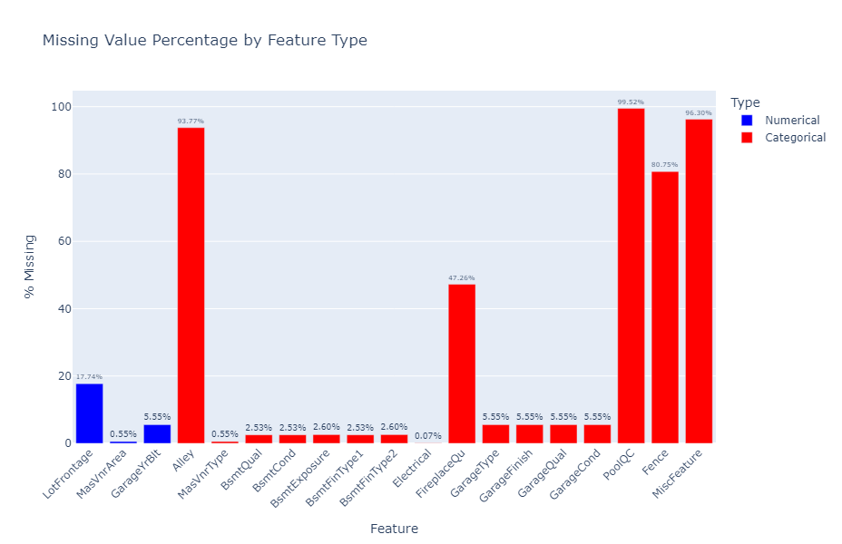
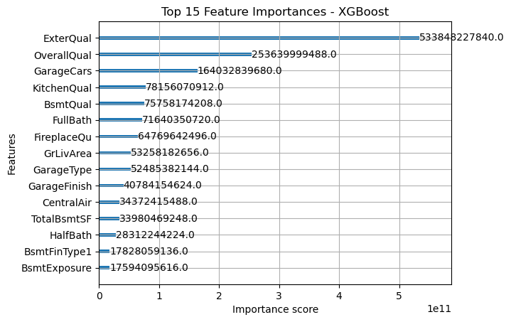
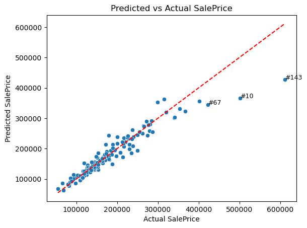
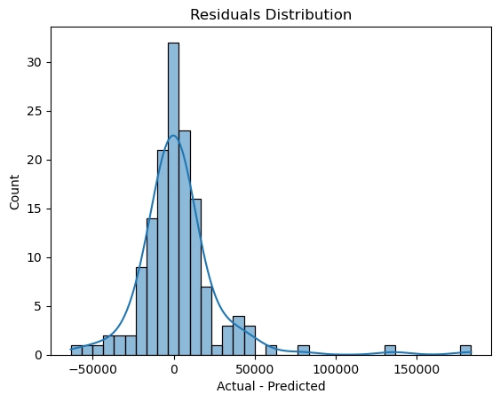
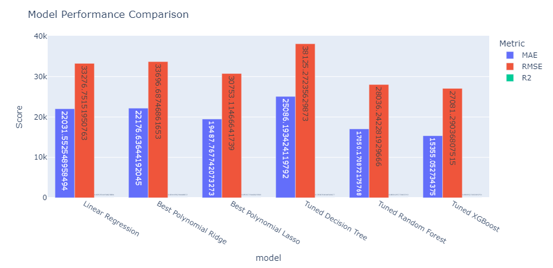

# 🏡 House Prices - Advanced Regression Techniques
<p align="center">
  <a href="https://www.kaggle.com/competitions/house-prices-advanced-regression-techniques">
    
  </a>
</p>

Welcome to my second Kaggle project in the **SSJ3-ML-Journey** series! This competition is focused on **predicting house prices** using advanced regression techniques and **creative feature engineering** with real-world data from Ames, Iowa.

---

## 🎯 Objective

To build a regression model that accurately predicts the **SalePrice** of homes based on a diverse set of **79 explanatory variables** covering physical attributes, quality metrics, and location data.

---

## 📦 Dataset Overview

- `train.csv` – 1460 rows × 81 columns (with target `SalePrice`)
- `test.csv` – 1459 rows × 80 columns (excluding `SalePrice`)
- `data_description.txt` – Detailed descriptions of all columns
- `sample_submission.csv` – Template for Kaggle submissions

### 📌 Target Variable

| Feature     | Description                        |
|-------------|------------------------------------|
| `SalePrice` | Final price of the house in dollars |

### 📌 Sample Feature Highlights

| Feature        | Description                                      |
|----------------|--------------------------------------------------|
| `OverallQual`  | Overall material and finish quality              |
| `GrLivArea`    | Ground living area in square feet                |
| `GarageCars`   | Number of garage car spaces                      |
| `YearBuilt`    | Year of house construction                       |
| `Neighborhood` | Location within Ames city limits                 |
| `LotFrontage`  | Linear feet of street connected to property      |
| `BsmtQual`     | Height of basement                               |

Full feature list can be found in `data/data_description.txt`.

---

## 🧪 Planned Workflow

- ✅ Data Loading and Cleaning  
- ✅ Missing Value Treatment  
- ✅ Exploratory Data Analysis (EDA)  
- ✅ Feature Engineering  
- ✅ Data Transformation (scaling, encoding)  
- ✅ Model Training (Linear, Ridge, Lasso, RF, XGBoost)  
- ✅ Hyperparameter Tuning (GridSearchCV / Optuna)  
- ✅ Model Evaluation (MAE, RMSE, R²)  
- ✅ Kaggle Submission  

---

## 📚 Key Skills Practiced

- 🧠 **Creative Feature Engineering**  
- 📏 **Regression Modeling & Tuning**  
- 🧹 **Smart Missing Value Imputation**  
- 📊 **Statistical EDA + Visual Insights**  
- 🛠️ **Model Evaluation & Ensemble Approaches**  

---

## 📸 Key Visualizations

<p align="center">
  
  <br/><em>Correlation Heatmap of Numeric Features</em>
</p>

<p align="center">
  
  <br/><em>Distribution of Missing Values</em>
</p>

<p align="center">
  
  <br/><em>Top 15 Most Important Features (XGBoost)</em>
</p>

<p align="center">
  
  <br/><em>Predicted vs Actual Sale Prices</em>
</p>

<p align="center">
  
  <br/><em>Model Residuals</em>
</p>

<p align="center">
  
  <br/><em>Model Performance Comparison</em>
</p>

---

## 📊 Visualizations

> 🔍 Click to view each image for insights generated throughout the project.

| Visualization                      | File Name                      |
|------------------------------------|---------------------------------|
| 🔥 Correlation Heatmap             | `outputs/Correlation_Heatmap.png`       |
| 🧱 Missing Value Distribution       | `outputs/Missing_Value_Distribution.png`|
| 🥇 Top 15 Features                 | `outputs/Top_15_Features.png`           |
| 📉 Residuals of Predictions        | `outputs/Residuals_Plot.png`            |
| 🧪 Actual vs Predicted             | `outputs/Prediction_vs_Actual.png`      |
| 🧠 Model Comparison Bar Chart      | `outputs/Model_Comparsion.png`          |

All images are stored in the project folder for quick analysis and comparison.

---

## 📊 Model Comparison

| Model                  | MAE         | RMSE        | R² Score |
|------------------------|-------------|-------------|----------|
| Linear Regression      | 22,031.55   | 33,276.75   | 0.8354   |
| Polynomial Ridge       | 22,176.64   | 33,696.69   | 0.8312   |
| Polynomial Lasso       | 19,487.77   | 30,753.11   | 0.8594   |
| Decision Tree (Tuned)  | 25,086.19   | 38,125.27   | 0.7839   |
| Random Forest (Tuned)  | 17,050.17   | 28,036.24   | 0.8831   |
| XGBoost (Tuned)        | **15,355.05** | **27,081.29** | **0.8910** |

✅ Best performing individual model: **Tuned XGBoost**

📌 These metrics are based on the validation set (typically 10% split).

🔁 Final submission used: `outputs/stacked_submission.csv`

---

## 💾 Submission Format

```csv
Id,SalePrice
1461,169000
1462,187000
```

---

## 🛠️ Future Work

- 🔍 SHAP interpretation of tree-based models  
- 🧪 Feature selection via **Lasso Regression**  
- 🤝 Ensemble methods: **Stacking** / **Blending**  
- 🛠️ Advanced preprocessing using `ColumnTransformer` pipelines  
- 🤖 AutoML experiments (e.g., **AutoSklearn**, **Optuna**)  
- 📉 Feature reduction & visualization using **PCA** / **t-SNE**

---

## 📚 Learnings (To Be Updated)

- 🧼 Importance of data cleaning in real estate datasets  
- 🎯 Handling **skewness** in target variable  
- 🔠 Encoding and managing **categorical + ordinal features**  
- 🛡️ Tuning **regularization** to avoid overfitting

---

## ✍️ Author

- **Name**: Guna Venkat Doddi  
- **Project**: Part of `SSJ3-Kaggle-Projects` repository  
- **Contact**: [](https://github.com/Guna-Venkat)

---

