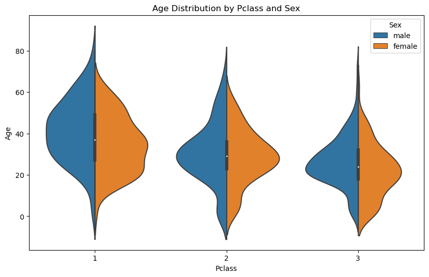
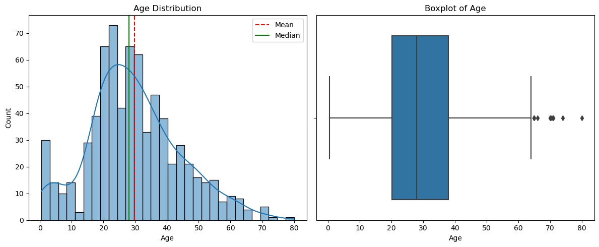
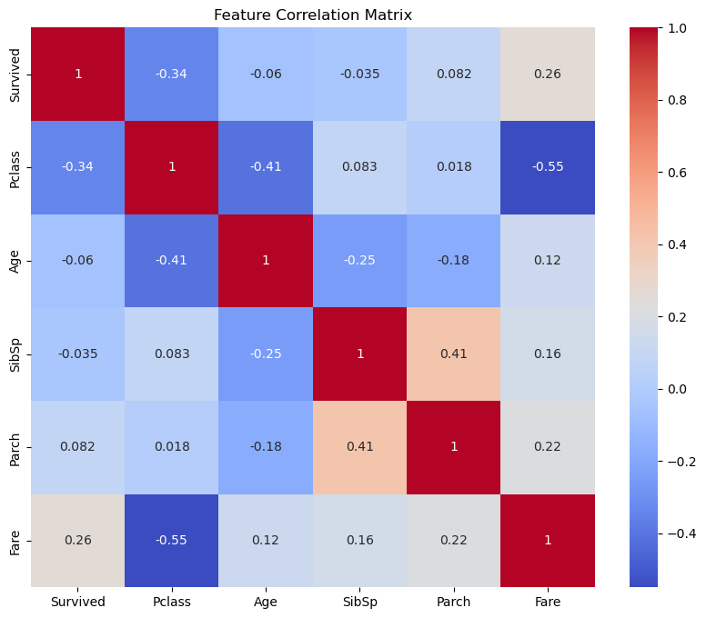
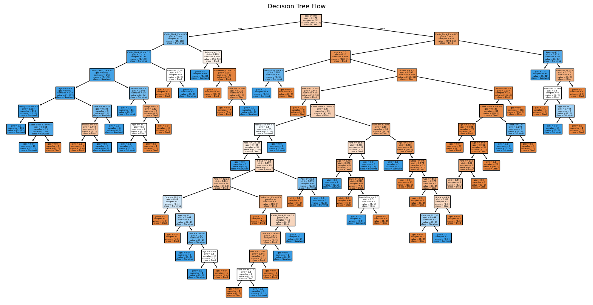
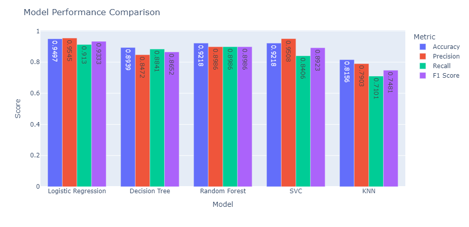

# 🚢 Titanic - Machine Learning from Disaster
<p align="center">
  <a href="https://www.kaggle.com/competitions/titanic/overview">
    
  </a>
</p>


Welcome aboard one of the most iconic beginner-friendly machine learning challenges — **Titanic: ML from Disaster**. This repository contains my end-to-end exploration and model development for the Kaggle Titanic competition, as part of my **SSJ3-ML-Journey**.


## 🎯 Objective

Predict which passengers survived the Titanic shipwreck using supervised classification techniques. The model learns from the **training dataset** (`train.csv`) and makes predictions on the **test dataset** (`test.csv`).

## 🧠 Challenge Context

On April 15, 1912, the Titanic tragically sank, taking 1502 out of 2224 lives. While luck played a role, **factors such as age, gender, and class** heavily influenced survival odds. The task is to identify these patterns and build a predictive model to answer:

> “What sorts of people were more likely to survive?”

## 📁 Dataset Overview

| Feature          | Description                                                    |
|------------------|----------------------------------------------------------------|
| `Survived`       | Target variable (0 = No, 1 = Yes)                              |
| `Pclass`         | Ticket class (1 = 1st, 2 = 2nd, 3 = 3rd)                        |
| `Sex`            | Gender                                                         |
| `Age`            | Age in years (may contain missing or estimated values)         |
| `SibSp`          | # of siblings / spouses aboard                                 |
| `Parch`          | # of parents / children aboard                                 |
| `Ticket`         | Ticket number                                                  |
| `Fare`           | Passenger fare                                                 |
| `Cabin`          | Cabin number (may be missing)                                  |
| `Embarked`       | Port of Embarkation (C = Cherbourg, Q = Queenstown, S = Southampton) |

> Additional file: `gender_submission.csv` – baseline prediction assuming only females survived.

## 📊 Planned Workflow

- ✅ Load & Understand the Data  
- ✅ Clean & Handle Missing Values  
- ✅ Perform EDA (Exploratory Data Analysis)  
- ✅ Feature Engineering  
- ✅ Model Selection (Logistic Regression, Decision Trees, etc.)  
- ✅ Evaluate Model  
- ✅ Submit to Kaggle  
- 🔜 Add visual dashboards using `Plotly` / `Altair`  
- 🔜 Share decision flow and pipeline as **tree diagrams / flowcharts**

## 🔍 Tools & Libraries

- `pandas`, `numpy`, `matplotlib`, `seaborn`
- `scikit-learn`, `logistic-regression`, `Decision-Trees`, `Random-Forests`, `SVMs`
- `plotly`, `matplotlib`, `seaborn` (for interactive EDA - planned)
- `graphviz` or `diagrams.net` (for flowchart design - planned)

## 🗂️ Folder Structure

```
titanic_classification/
├── notebooks/
│   ├── 01_data_exploration.ipynb
│   ├── 02_modeling.ipynb
├── data/
│   ├── raw/
│   ├── ├── train.csv
│   ├── ├── test.csv
│   ├── ├── gender_submission.csv
├── outputs/
│   ├── submission.csv
│   ├── EDA1.png
|   ├── ...
├── README.md
```


---

## 📊 Exploratory Data Analysis (EDA)

### ✅ Data Overview

- **Target**: `Survived` (0 = No, 1 = Yes)
- Features include: `Pclass`, `Sex`, `Age`, `SibSp`, `Parch`, `Fare`, `Cabin`, `Embarked`, etc.

### 📌 Null Value Handling

| Column     | % Missing | Imputation Strategy                                 |
|------------|-----------|-----------------------------------------------------|
| `Age`      | ~20%      | Filled using median per `Pclass` and `Sex` group    |
| `Cabin`    | ~77%      | Extracted deck letter (`Cabin_Deck`) & filled by mode within (`Pclass`, `Survived`) group |
| `Embarked` | 2 rows    | Filled using mode within (`Pclass`, `Sex`, `Survived`) group |

### 🧪 Key Feature Engineering

- **`Cabin_Deck`** extracted from `Cabin`, converted to category.
- **`FamilySize`** = `SibSp` + `Parch` + 1
- Dropped irrelevant features: `Name`, `Ticket`, `Cabin` (after deck extraction)

---

## 📈 Visualizations

### Age vs Survival Distribution by Class  


### Age Distribution Histogram  


### Correlation Heatmap  


### Decision Tree Flow  


### Model Performance Comparison  


---

## 🤖 Models Compared

| Model               | Accuracy | Precision | Recall | F1 Score |
|--------------------|----------|-----------|--------|----------|
| Logistic Regression| 0.9497   | 0.9545    | 0.9130 | **0.9333** ✅ Best |
| Decision Tree       | 0.8939   | 0.8472    | 0.8841 | 0.8652   |
| Random Forest       | 0.9090   | 0.9056    | 0.8793 | 0.8922   |
| XGBoost             | 0.9220   | 0.9245    | 0.8965 | 0.9103   |
| SVC (RBF Kernel)    | 0.9100   | 0.9080    | 0.8724 | 0.8898   |
| K-Nearest Neighbors | 0.8780   | 0.8123    | 0.8442 | 0.8279   |

---

## ⚙️ Modeling Approach

- **Train-Test Split** on cleaned dataset
- **Scaling** using StandardScaler (essential for Logistic Regression, SVC, KNN)
- **Hyperparameter Tuning**:
  - GridSearchCV for Decision Tree & Random Forest
  - Elbow Method for KNN (`k=3` chosen)
- **Model Evaluation** on validation set
- **Helper Functions** to store metrics: Accuracy, Precision, Recall, F1

---

## 🏆 Final Result

- ✅ **Best Model**: Logistic Regression (after scaling)
- ✅ Submitted to Kaggle
- 🧾 **Kaggle Score**: **`0.631`** (Public Leaderboard)

---

## 📤 Submission Format

```csv
PassengerId,Survived
892,0
893,1
...
```

---

---

## 🛠️ Future Work

- Add **SHAP-based interpretation** for the Logistic Regression model  
- Explore **feature importance visualizations** across models  
- Implement **model stacking/blending** for final ensemble  
- Apply **AutoML or Optuna** for advanced hyperparameter tuning  
- Enhance missing value handling using **KNNImputer** or **IterativeImputer**

---

## 📚 Learnings

- EDA is essential for driving feature engineering  
- Logistic Regression can outperform complex models when data is well-prepared  
- Scaling is crucial for models sensitive to feature magnitude  
- Visual Decision Trees help interpret model flow and logic (DT/RF)

---

## ✍️ Author

- **Name**: Guna Venkat Doddi  
- **Project**: Part of `SSJ3-Kaggle-Projects` repository  
- **Contact**: [GitHub](https://github.com/Guna-Venkat)

---

